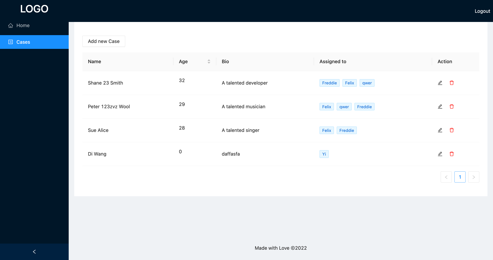
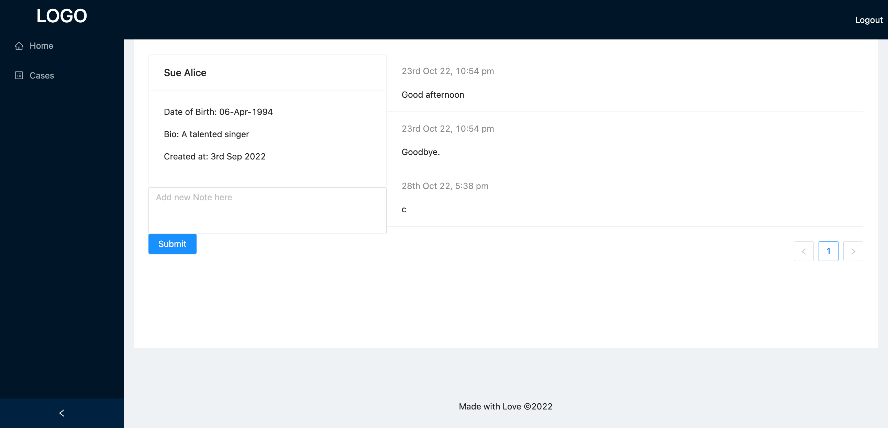

# CRM 

## Description
Description
A simple case management built with flexibility to to extend scope. Publicly known Client Relationship Management (CRM) system usually features numerous functions and components but not tailored for some businesses. 

## User story
When I manage cases, I would like to see case’s info and notes. 

## Deployment (under maintenance)
[Open the App here](https://guarded-oasis-34202.herokuapp.com/) (Heroku no longer available)
An alternative platform will take place.

## Technologies Used
React, Ant Design

GraphQL, Node.js

MongoDB and the Mongoose ODM

## Screenshots

